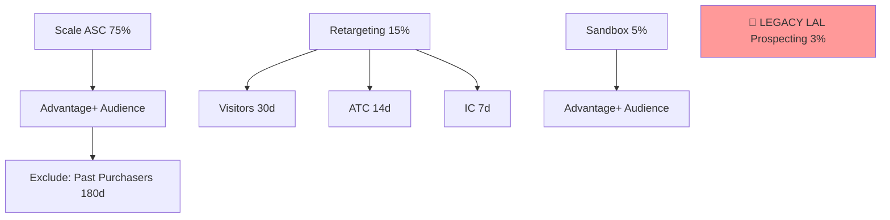

# /jf-meta-audience-audit — Meta Audience Audit (Jetfuel)

Audit a client's Meta audience setup against the JF Andromeda playbook. Distinct from the existing `/audience-audit` skill (Google Ads remarketing audiences) — this is the Meta variant, focused on detecting deprecated 2018-era audience tactics that drag accounts down in 2026.

The biggest fails this audit catches:
- Lookalike audiences still in use (deprecated per `feedback_meta_ads_2026.md`)
- Interest-stacking ad sets
- TOF/MOF/BOF prospecting silos
- Missing purchaser exclusions on prospecting
- Custom audiences with no clear funnel mapping
- Ad sets running same audience without mutual exclusions (overlap waste)

## Arguments

- Client name. Default: ask.
- `--include-paused` — include paused ad sets in the analysis. Default: false (live only).
- `--account-id` — Meta ad account ID (with `act_` prefix). Default: pull from HQ.

## Steps

### 1. Load identity, client context

- Read `.claude/me.md`. STOP if missing.
- Read `.claude/ops/jf-meta-audience-audit/config.json` for client overrides + vertical-specific exclusion rules.
- `list_clients(search=client) → get_client_platforms` → meta_account_id.

### 2. Pull all custom audiences

Use Meta MCP:
```
mcp__meta__meta_list_audiences(account_id={...})
```

For each: id, name, subtype (CUSTOM/WEBSITE/LOOKALIKE/ENGAGEMENT/OFFLINE), approximate_count, time_created, retention_days, rule (the source query), lookalike_spec.

### 3. Pull active ad sets and their targeting

```
mcp__meta__meta_list_adsets(account_id={...}, status="ACTIVE")
```

For each: name, targeting (custom_audiences, excluded_custom_audiences, interests, geo_locations, age_min, age_max, genders), campaign_id, daily_budget, optimization_goal, billing_event.

Also pull campaign info via `mcp__meta__meta_list_campaigns` to know which campaign each ad set belongs to (Scale/Retargeting/Sandbox/Other).

### 4. Classify audiences against the JF Andromeda model

For each custom audience, map to one of:

- **PROSPECTING_SEED** — purchase customer file (used as seed for Advantage+ Audience, NOT lookalike)
- **PROSPECTING_AVOID** — anything to exclude from prospecting (existing purchasers, current employees, etc.)
- **MID_FUNNEL** — pixel-based visitor / engagement audiences (30-180d)
- **BOFU** — high-intent: ATC, IC, page-specific viewers
- **RETENTION** — past purchasers, LTV-based
- **LEGACY_LAL** — any lookalike audience (FLAG: deprecated)
- **UNCATEGORIZED** — audiences not fitting any bucket; usually orphaned

### 5. Flag deprecated tactics (the headline findings)

Per `feedback_meta_ads_2026.md`:

🔴 **Lookalike audiences in use** — any ad set targeting a `LOOKALIKE` subtype. Output: list of LAL audiences, the ad sets using them, the spend allocated, and the migration path ("Replace with Advantage+ Audience using {seed_audience} as a suggestion").

🔴 **Interest-stacking ad sets** — any ad set with `interests` array length > 0 AND inside the Scale ASC campaign. Andromeda doesn't treat interests as constraints; they fragment delivery.

🔴 **TOF/MOF/BOF prospecting silos** — multiple "prospecting" campaigns with different audiences. Should be one consolidated ASC.

🟡 **Missing purchaser exclusion** — any prospecting ad set NOT excluding the past-purchasers audience. Wastes spend re-targeting existing customers via prospecting.

🟡 **Custom audience overlap** — ad sets simultaneously active, same geo, same optimization event, audiences with logical overlap and no mutual exclusion. Classify HIGH/MEDIUM/LOW.

🟡 **Orphaned audiences** — custom audiences not used by any active ad set. Cleanup target.

### 6. Map current architecture

Walk the campaign → ad set → audience tree. Produce:

```
Scale ASC: 75% budget
  └─ Advantage+ Audience (broad) [no constraints] ✅
     └─ Excludes: Past Purchasers (180d) ✅

Retargeting Manual: 15% budget
  ├─ Visitors 30d MINUS Purchasers 180d ✅
  ├─ ATC 14d MINUS Purchasers 180d ✅
  └─ IC 7d MINUS Purchasers 180d ✅

Sandbox: 5% budget
  └─ Advantage+ Audience ✅

LEGACY_PROSPECTING_LAL_2022 (3% budget): 🔴 DEPRECATED
  └─ LAL 1% Purchase + Interests [Wellness, Skincare]
```

### 7. Build the recommended architecture

Based on the gaps, write out the target state:

```
Scale ASC ← consolidate all prospecting here
Retargeting Manual ← Visitors 30d, ATC 14d, IC 7d, all excluding Purchasers 180d  
Sandbox ← keep separate, low budget
DELETE: LEGACY_PROSPECTING_LAL_2022, Interest_Stack_Wellness, LAL_1pct_Purchase
```

### 8. Generate a Mermaid diagram

Embed in the report:



### 9. Output the report

`.claude/ops/jf-meta-audience-audit/reports/{client}-{date}.md`:

```
# /jf-meta-audience-audit — {Client} — {date}

## TL;DR
- {n} custom audiences, {n} active ad sets analyzed.
- Andromeda compliance: {x}/4 (Pillar 1 of the audit rubric)
- DEPRECATED tactics in use: {list}
- Estimated wasted spend per month: ${X}

## 🔴 Critical (deprecated)
| Issue | Ad sets affected | Monthly spend | Fix |

## 🟡 Medium
| Issue | Ad sets | Risk | Fix |

## Current architecture (Mermaid)
[diagram]

## Recommended architecture
[target state]

## Migration plan
1. Pause LAL prospecting → migrate budget to Scale ASC
2. Strip interests from Scale ASC ad sets
3. Add Purchasers-180d exclusion to prospecting (verified via list_my_audiences)
4. Archive orphaned audiences

## Audiences inventory (table)
| Name | Subtype | Size | Mapped to | Used by | Action |
```

Also Sheet via `mcp__google-workspace__create_spreadsheet` with tabs: Audience inventory · Ad set targeting · Overlap matrix · Migration plan.

### 10. Present in-conversation summary

```
Audit for {client}:
- Andromeda compliance: 2/4 (lookalikes still in use, interests stacked on Scale ASC)
- Wasted spend est: ${X}/mo
- 3 deprecated tactics to retire
- 5 orphaned audiences to archive

Recommended next: /jf-rebalance after the LAL pause to redirect the freed budget.
Migration steps in {sheet_link}.
```

## Important Rules

- **Lookalikes are deprecated. Period.** No carve-outs. (`feedback_meta_ads_2026.md`)
- **Advantage+ Audience replaces lookalikes.** The custom audience becomes a "suggestion" Meta uses but doesn't constrain.
- **Never pause via this skill.** Generates the migration plan, surfaces the fix; humans execute via `/jf-rebalance` or manual review.
- **Purchaser exclusion is non-negotiable for prospecting.** Even one ad set without it is flagged.
- **Display all times in user's timezone.**
- **The Sheet is the deliverable.** Conversation summary is a preview.

## Config

`.claude/ops/jf-meta-audience-audit/config.json`:

```json
{
  "clients": {
    "hampton-water": {
      "hq_client_id": 37,
      "meta_account_id": "act_xxx",
      "expected_structure": "andromeda_v1",
      "purchasers_audience_id": "...",
      "purchasers_retention_days": 180
    }
  },
  "deprecated_tactics": [
    {"type": "lookalike", "any_lal_in_active_adset": true},
    {"type": "interest_stack", "interests_on_scale_asc": true},
    {"type": "tof_mof_bof_silo", "multiple_prospecting_campaigns": true}
  ]
}
```

## Why this skill exists

The existing `/audience-audit` is for Google Ads remarketing checklists. The existing `/meta-ad-audit` audits creative against competitors. Neither audits the *audience architecture* of a Meta account against Andromeda principles. This skill closes that gap, with the specific lens that a Jetfuel strategist would apply: kill the lookalikes, kill the interest stacks, consolidate the prospecting, prove the exclusions exist.
